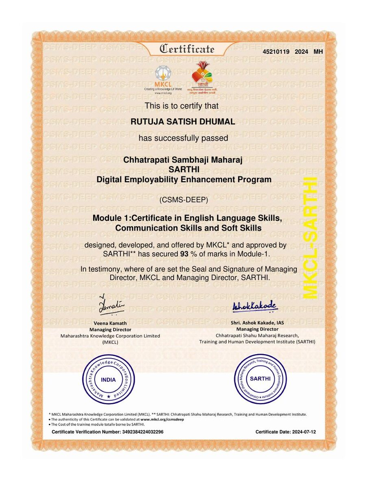

# 🏆 Certifications, Badges & Learning Achievements

### Verified learning, credentials and professional development

> **Recruiter note:** Every preview below points to an actual certificate/badge image stored in this repository. Where the original PDF is available, **VIEW CERTIFICATE** opens it. **VERIFY** is used only for genuine credential-specific verification pages.

---

## ⭐ Featured Credentials

<table>
<tr>
<td width="50%" valign="top" align="center">

### ☁️ Oracle Cloud Infrastructure
**2025 Certified Data Science Professional**  
**Oracle University** · October 30, 2025  
Credential ID: `103033249OCI25DSOCP`

[📜 **VIEW CERTIFICATE**](assets/certifications/OCI%20data%20science%20Certificate%20by%20oracle%20university.pdf)

</td>
<td width="50%" valign="top" align="center">

### 🐍 Python for Data Science
**IBM** · Course Completion

**Focus:** Python fundamentals and applications for data science.

[📜 **VIEW CERTIFICATE**](assets/certifications/python%20for%20data%20science%20by%20IBM.pdf)

</td>
</tr>
<tr>
<td width="50%" valign="top" align="center">

### 📊 Career Skills in Data Analytics
**LinkedIn Learning** · January 16, 2025  
Certificate ID: `e6aba757993976729d7b8dbc3d19890a6ada6df9a22ff089b2d165ce44cad4a8`

[📜 **VIEW CERTIFICATE**](assets/certifications/Introduction%20to%20Career%20Skills%20in%20Data%20Analytics%20by%20linkedin.pdf)  
[✓ **VERIFY**](https://www.linkedin.com/learning/certificates/e6aba757993976729d7b8dbc3d19890a6ada6df9a22ff089b2d165ce44cad4a8)

</td>
<td width="50%" valign="top" align="center">

### 📈 Introduction to Power BI
**DataFlair** · February 4, 2025  
Certificate ID: `7F11259FF9-7CB14C32B0-7591B16224`

[📜 **VIEW CERTIFICATE**](assets/certifications/Introduction-to-Power-BI%20by%20Data%20flair.pdf)  
[✓ **VERIFY**](https://data-flair.training/verify/7F11259FF9-7CB14C32B0-7591B16224/)

</td>
</tr>
</table>

---

## 🧠 Data, AI & Programming

<table>
<tr>
<td width="50%" valign="top" align="center">

### Natural Language Processing Fundamentals
**Infosys Springboard**

[📜 **VIEW CERTIFICATE**](assets/certifications/Natural%20Language%20Processing%20Fundamentals%20by%20Infosys.pdf)
</td>
<td width="50%" valign="top" align="center">

### Natural Language Processing in Practice
**Infosys Springboard**

[📜 **VIEW CERTIFICATE**](assets/certifications/Natural%20Language%20Processing%20in%20Practice%20by%20infosys.pdf)
</td>
</tr>
<tr>
<td width="50%" valign="top" align="center">

### Basics of Python
**Infosys Springboard**

[📜 **VIEW CERTIFICATE**](assets/certifications/Basics%20of%20python%20by%20infosys.pdf)
</td>
<td width="50%" valign="top" align="center">

### ChatGPT & AI in Microsoft Office
**Skill Nation**

[📜 **VIEW CERTIFICATE**](assets/certifications/Rutuja%20Dhumal_ChatGPT%20%26%20AI%20in%20Microsoft%20Office.pdf)  
[✓ **VERIFY**](https://verify.skillnation.ai/certificate?certificate_id=685232e71c77f73cfa4ac9bb)
</td>
</tr>
<tr>
<td width="50%" valign="top" align="center">

### Microsoft AI Skills Fest
**Microsoft**

[📜 **VIEW CERTIFICATE**](assets/certifications/Microsoft%20AI%20festival.pdf)  
[🏅 **VIEW BADGES**](https://learn.microsoft.com/en-us/users/rutujadhumal-3742/achievements)
</td>
<td width="50%" valign="top" align="center">

### Master Data Management for Beginners
**TCS iON**

[📜 **VIEW CERTIFICATE**](assets/certifications/master%20of%20data%20management_tcs.pdf)
</td>
</tr>
</table>

---

## 📊 Business Intelligence & Power BI

<table>
<tr>
<td width="50%" valign="top" align="center">

### Data Analytics using Power BI Workshop
**Newton School**

[📜 **VIEW CERTIFICATE**](assets/certifications/power%20bi%20workshop%20certificate%20by%20Newton%20school.jpg)
</td>
<td width="50%" valign="top" align="center">

### Introduction to Power BI
**DataFlair**

[📜 **VIEW CERTIFICATE**](assets/certifications/Introduction-to-Power-BI%20by%20Data%20flair.pdf)  
[✓ **VERIFY**](https://data-flair.training/verify/7F11259FF9-7CB14C32B0-7591B16224/)
</td>
</tr>
</table>

---

## 💬 Communication & Professional Skills

<table>
<tr>
<td width="50%" valign="top" align="center">

### Basics of Business Communication
**Infosys Springboard**

[📜 **VIEW CERTIFICATE**](assets/certifications/Basics%20of%20Business%20Comunication%20infosys%20certificate.pdf)
</td>
<td width="50%" valign="top" align="center">

### Saving Time by Setting Goals
**Infosys Springboard**

[📜 **VIEW CERTIFICATE**](assets/certifications/Saving%20time%20by%20setting%20Goal%20certificate%20(infosys).pdf)
</td>
</tr>
<tr>
<td width="50%" valign="top" align="center">

### Communication Skills for Beginners
**Udemy**

[📜 **VIEW CERTIFICATE**](assets/certifications/communication%20skill%20by%20UDEMY.pdf)  
[✓ **VERIFY**](https://www.udemy.com/certificate/UC-65c4f7da-cfb3-458f-b4df-4ae57170a05c/)
</td>
<td width="50%" valign="top" align="center">

### Smart English Basics for Professionals
**Great Learning Academy**

[📜 **VIEW CERTIFICATE**](assets/certifications/Smart%20English%20Basics%20for%20Professionals%20by%20Great%20Learning.pdf)
</td>
</tr>
<tr>
<td width="50%" valign="top" align="center">

### Tata Crucible Corporate Quiz
**Participation Certificate**

[📜 **VIEW CERTIFICATE**](assets/certifications/Tata%20corporatr%20quize%20participation%20certificate.pdf)  
[✓ **OPEN CERTIFICATE**](https://unstop.com/certificate-preview/83a60137-ebbe-40c1-9979-df7f071d847f)
</td>
<td width="50%" valign="top" align="center">

### Nestlé Game / Learning Achievement
**Nestlé**

[📜 **VIEW CERTIFICATE**](assets/certifications/Nestle%20game%20certificate.pdf)
</td>
</tr>
</table>

---

## ☁️ Oracle Badge

### Oracle OCI Data Science Badge
**Oracle University**

[🏅 **VIEW BADGE**](assets/certifications/previews/oci%20data%20sci%20oracle%20badge.jpg)

---

## 🌐 SARTHI — CSMS-DEEP

**Digital Employability Enhancement Program**

> The repository currently contains original PDFs for Modules 1 and 2, while Modules 3 and 4 are represented by their uploaded certificate previews. I am not linking to non-existent PDF paths.

<table>
<tr>
<td width="50%" valign="top" align="center">

### Module 1 — English, Communication & Soft Skills

[📜 **VIEW CERTIFICATE**](assets/certifications/SAARTHI%20certificates/MODULE1_Certificate.pdf)
</td>
<td width="50%" valign="top" align="center">

### Module 2 — Basic Information Technology Skills

[📜 **VIEW CERTIFICATE**](assets/certifications/SAARTHI%20certificates/MODULE%202_Certificate.pdf)
</td>
</tr>
<tr>
<td width="50%" valign="top" align="center">

### Module 3 — Web Designing

[🖼️ **VIEW CERTIFICATE IMAGE**](assets/certifications/previews/module%203_certificate.jpg)
</td>
<td width="50%" valign="top" align="center">

### Module 4 — Advanced Web Designing

[🖼️ **VIEW CERTIFICATE IMAGE**](assets/certifications/previews/module%204_certificate.jpg)
</td>
</tr>
</table>

Certificate Verification Number: `3492384224032296`

[🔗 **SARTHI / MKCL certificate information & verification**](https://mkcl.org/csmsdeep/mr/csms-deep-diploma/certificate)

---

## 🪪 Microsoft Learn — Badges & Credentials

---

## 🔎 Verification policy

- **VIEW CERTIFICATE** opens the original certificate file when that file exists in the repository.
- **VIEW CERTIFICATE IMAGE** is used where only the uploaded certificate preview is currently available.
- **VERIFY** is included only when a credential-specific verification URL is known.
- No generic issuer homepage is presented as a personal credential verification link.
- No certificate IDs, scores, rankings or achievements are invented.

---

### 🚀 Keep learning. Keep building. Keep proving.

